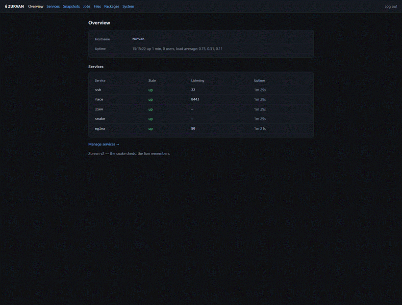

# Zurvan

> A minimal Linux distribution assembled from scratch — kernel, static userland, a
> custom PID 1, verified boot, a declarative service supervisor, a static package
> system, snapshots, a sandboxed job runner, and a web admin panel — that boots
> entirely from RAM and keeps everything worth keeping on one `/data` partition.

<p align="center">
  <a href="https://github.com/masoudqashqai/Zurvan-OS/releases/latest/download/zurvan-2.2.0.iso">
    
  </a>
  &nbsp;
  <a href="https://github.com/masoudqashqai/Zurvan-OS/releases/latest">
    
  </a>
</p>

<p align="center">
  <a href="https://github.com/masoudqashqai/Zurvan-OS/releases/latest/download/zurvan-catalog-2.2.0.tar.gz">
    
  </a>
  <br><em>The ISO carries four packages. The signed catalog pack carries the rest.</em>
</p>

<p align="center">
  
  <br><em>The built-in web admin panel — over HTTPS, on by default.</em>
</p>

Zurvan is a from-source Linux system, not a rebranded distribution. Every layer is
assembled directly in this repository: the kernel is configured and built from source,
the userland is statically linked (**no dynamic loader ships at all**), the init process
is ~200 lines of C you can read top to bottom, and every service — supervisor, snapshot
daemon, job runner, web panel — is a small static binary meant to be read whole.

Named for the Zoroastrian principle of boundless time, the father of twin opposites,
v2 makes the system literally two things at once:

- **The snake — what sheds its skin.** The OS itself: booted from a signed image into
  RAM, reborn identical on every boot, root sealed read-only — it never drifts, and every
  boot is a first boot. Its instrument is [`zurvan-snake`](snake/), which puts that
  ephemerality to work — running jobs in sandboxes that evaporate without a trace.
- **The lion — what endures.** One persistent `/data` partition holding your YAML config,
  installed apps, and service state. Its instrument is [`zurvan-lion`](lion/), the
  snapshot daemon that guards it — everything you would cry about losing lives under the
  lion's watch; everything else is disposable.

**The OS is never installed — only the data is.** A machine is described entirely by three
things: the image version, one YAML file, and the contents of `/data`. Upgrading is
replacing one signed image file (with automatic rollback); a two-year-old Zurvan server is
provably identical to the day it was set up.

---

## Try it — live, no install

Download **[zurvan-2.2.0.iso](https://github.com/masoudqashqai/Zurvan-OS/releases/latest/download/zurvan-2.2.0.iso)**
and boot it (VMware, QEMU, or real hardware). It comes up entirely in RAM, self-configures
from its built-in YAML, and starts the **web admin panel** automatically. The console
prints a banner:

```
+------------------------------------------+
| Zurvan web panel                         |
| URL:    https://<this-box-ip>:8443/      |
| Token:  <16 hex chars>                   |
+------------------------------------------+
```

Open that URL in your browser (accept the self-signed certificate — it's per-box and made
on first boot), paste the token, and you're in. Run `zurvan-panel` on the console anytime
to print the URL and token again.

Nothing persists in live mode — it's for looking around. To keep data, **install to a disk**.

---

## Install to a disk

Installing writes three things to the disk: the signed boot image (two A/B slots), a small
boot partition, and the persistent `/data` partition. The OS still runs from RAM after boot;
only `/data` and the image live on disk.

1. Boot the ISO (as above).
2. On the console, run the installer against your target disk — this is the **only** program
   allowed to touch a raw disk:

   ```sh
   zurvan-install --yes /dev/sda
   ```

3. Remove the CD and reboot. The box now boots from the disk.

On first boot it generates its SSH host keys and the panel's TLS identity on `/data`, so they
stay stable across reboots. A fresh box ships with **no SSH credential**, so get in through the
**web panel** (its login token prints to the console at first boot) or the console itself — then
add your SSH key. Edit `/data/zurvan.yaml` to set the hostname, network, and users, and reboot to
apply those; **services can be enabled or disabled live from the panel** (or with `zurvan-svc` /
`zurvan-pkg enable`) with no reboot.

Upgrades are equally simple and safe: feed a signed image bundle to `zurvan-upgrade` (or the
panel's System page). It verifies the signature, writes the *inactive* slot, boots it once,
and rolls back automatically if that boot fails.

---

## Recommended hardware

Zurvan is tiny, but it is a **BIOS**, **x86-64** system today.

| Component | Requirement |
|-----------|-------------|
| **CPU** | x86-64 (64-bit). One core is enough. |
| **Firmware** | **Legacy BIOS** — *not* UEFI. In VMware: VM Settings → Advanced → Firmware type → **BIOS**. (UEFI + Secure Boot is on the post-v2 list.) |
| **RAM** | 256 MB minimum (the OS runs from RAM); **512 MB – 1 GB** recommended so the panel and per-service tmpfs have headroom. |
| **Disk** | Any disk for an install. `/data` holds the YAML, installed apps, and snapshots — a few GB is generous. Live (no-disk) boot needs no disk at all. |
| **Network** | e1000 (VMware's default for "Other Linux") or virtio-net; DHCP by default. |

---

## What's inside

| Layer | Implementation |
|-------|----------------|
| **Kernel** | Linux 6.6 LTS, built from source; a [readable config fragment](kernel/config-fragment) plus a hardening baseline (stack protector, KASLR, no modules, no `/dev/mem`, …) |
| **Userland** | static [busybox](userland/build-busybox.sh), [bash](userland/build-bash.sh), [dropbear](userland/build-dropbear.sh) (SSH), [e2fsprogs](userland/build-e2fsprogs.sh), [gpgv](userland/build-gpgv.sh), [BearSSL](userland/build-bearssl.sh) — all static |
| **Init (PID 1)** | [~200 lines of C](init/init.c): mounts, console, supervision, reaping — and it never exits |
| **Verified boot** | GPG-signed kernel/initrd/modules enforced by GRUB; A/B image slots with a signature-gated `zurvan-upgrade` and automatic rollback; read-only root |
| **Supervisor** | [`zurvan-svc`](svc/) — a small declarative service manager: dependency order, restart-on-crash, live enable/disable, `no_new_privs`, drop-to-user |
| **Packages** | [`zurvan-pkg`](packages/pkgtool/) — install static-binary packages from a curated [catalog](catalog/); the [set-dresser](packages/pkgtool/) links them into standard paths every boot |
| **Catalog** | four packages ride on the ISO so a disconnected box is useful on day one; the rest is a signed [download](catalog/README.md#the-catalog-pack) — the catalog grows, the ISO doesn't |
| **The lion** | [`zurvan-lion`](lion/) — checksummed, atomic `/data` snapshots in a ring buffer; overlay or exact (mirror) restore |
| **The snake** | [`zurvan-snake`](snake/) — runs jobs in an evaporating tmpfs mount-namespace sandbox; nothing touches the host |
| **The face** | [`zurvan-face`](face/) — one static binary serving the whole admin panel over HTTPS |

### The web panel

Everything the panel does is possible over SSH with `vi` and one YAML file — but a server's
face is a browser tab. Over HTTPS it shows live service state (with listening ports and
uptime) and per-service **restart / enable / disable**, the lion's snapshots with a restore
button, the snake's job runner and history, a `/data` file browser and editor (new folder
and file, upload, rename, copy, delete — binaries are protected from accidental edits), and
package upload / install / **enable** / remove — enabling a service package writes it into
`zurvan.yaml` and starts it live. Signed image upgrades and reboot round it out. Every
action reports its result. It runs as an ordinary supervised service and can be turned off
with one line in the YAML.

### Configuration is one YAML file

```yaml
hostname: zurvan
network:
  eth0:
    dhcp: true
users:
  - name: zurvan
    # SSH is key-only. Paste your public key to allow remote login; until you
    # do, administer from the console and the web-panel token (printed at boot).
    # authorized_keys:
    #   - "ssh-ed25519 AAAA... your-key"
lion:
  every: 24h        # /data snapshot schedule
  keep: 7
services:
  - networking
  - ssh
  - face            # the web panel (on by default)
  - lion            # daily /data snapshots (on by default)
  - snake           # the sandboxed job runner (on by default)
  # - nginx         # once installed from the catalog
```

The config lives at `/data/zurvan.yaml` (or the built-in `/etc/zurvan.yaml` when there is
no disk). Every action is idempotent; it is reapplied on every boot. A fresh install ships
with **no SSH credential and daily backups on** — you get in via the panel's first-boot
token, then add your key.

### The catalog

A **package** is one gzipped tarball of static binaries plus a manifest. The
**catalog** is the curated set of them — the promise is not "runs any Linux
software," it is *everything in the catalog works perfectly and cannot break
each other.*

Four packages ride on the ISO, so a box with no network is useful the moment
you install it:

| Package | What it is |
|---------|-----------|
| [`nginx`](catalog/build-nginx.sh) | Web server, fully static — a real supervised service |
| [`sqlite3`](catalog/build-sqlite3.sh) | The embedded SQL database; a database is one file |
| [`curl`](catalog/build-curl.sh) | HTTP/TLS client, over BearSSL — no OpenSSL in the image |
| [`tick`](catalog/build-tick.sh) | A heartbeat daemon; the supervisor's demo service |
| [`hello`](catalog/build-hello.sh), [`zurvanos`](catalog/build-zurvanos.sh) | The smallest possible packages — proof the pipeline works |

The rest of the catalog is a **separate signed download**,
`zurvan-catalog-<VERSION>.tar.gz`, published next to the ISO on the
[releases page](https://github.com/masoudqashqai/Zurvan-OS/releases). Verify it,
then upload a package through the panel or `scp` it across — nothing on the box
ever fetches software over the network, which is the whole point.

That split is deliberate: the catalog can grow to any size without the ISO
gaining a byte. See [`catalog/README.md`](catalog/README.md).

---

## Building from source

Any reasonably current Linux with a C toolchain. Debian/Ubuntu prerequisites:

```sh
apt install build-essential flex bison libssl-dev libelf-dev bc cpio curl xz-utils \
            gnupg qemu-system-x86 grub-pc-bin xorriso mtools
```

Then, from the repo root:

```sh
make all           # kernel + static userland + init/supervisor/lion/snake/face
make catalog       # build the catalog packages (nginx, sqlite3, curl, hello, tick, …)
make catalog-pack  # pack them as a signed release download (build/zurvan-catalog-<VERSION>.tar.gz)
scripts/make-keys.sh   # one-time: generate the image-signing key (kept in keys/, gitignored)
scripts/make-iso.sh    # produce build/zurvan.iso + build/zurvan-<VERSION>.iso (signed)
make run           # boot it in QEMU (-nographic; Ctrl-A X to exit)
```

On **WSL**, set `ZURVAN_SRC_BASE` to a native-ext4 path (e.g. `/root/zurvan-src`); building on
a `/mnt/*` Windows mount is ~10× slower. The repo enforces LF line endings — a CRLF script
inside the image would break the boot chain.

---

## Repository layout

```
kernel/      config fragment + build script
userland/    busybox, bash, dropbear, e2fsprogs, gpgv, BearSSL (all static)
init/        PID 1 source (C)
svc/  lion/  snake/  face/   the C daemons (supervisor, snapshots, jobs, panel)
packages/    installer, package tool, first-boot YAML provisioner
catalog/     build-<name>.sh recipes for static-binary packages
scripts/     rootfs assembly, key/sign, ISO builder, QEMU runner
tests/       per-milestone "done when" acceptance suites (QEMU)
docs/        milestone-by-milestone build notes
ROADMAP.md   the road to v2 (all six milestones done)
```

## Design principles

- **Bounded scope.** Each piece does one thing and is small enough to read whole.
- **Static or it is not a package.** No dynamic loader, no shared libraries, no dependency hell.
- **Verified, not assumed.** Every layer was brought up with an observable check; every
  milestone has a reproducible acceptance test in [`tests/`](tests/).
- **The disk is never the OS.** Root is RAM-backed and reborn each boot; only `/data` and the
  signed image endure.

## Roadmap

All six v2 milestones are done and boot-verified — see [`ROADMAP.md`](ROADMAP.md). Deferred
beyond v2: UEFI + enroll-your-own-key Secure Boot, TPM-sealed keys, and image/container duality.

## License

[MIT](LICENSE). The components Zurvan builds from source (Linux, busybox, bash, dropbear,
e2fsprogs, GnuPG, BearSSL, and the catalog packages — nginx, sqlite3, curl, caddy) keep their
own upstream licenses.
